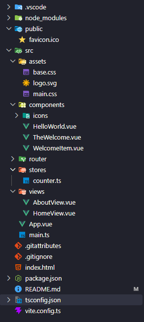

# Step 1

## Set Up Vue

```
npm create vue@latest
```

```
Project name : _____

Use TypeScript : Yes

Select features to include in your project:
  - Router (SPA development)
  - Pinia (state management)
  - Linter (error prevention)
  - Prettier (code formatting)

Select experimental features to include in your project:
  none

Skip all example code and start with a blank Vue project?
  No

```



---

# Step 2

## Set Up Vuetfiy And Tailwind

```
npm i vuetify
npm i @mdi/font
```

```ts
src > plugin > vuetify.ts

// Vuetify
import 'vuetify/styles'
import { createVuetify } from 'vuetify'
import * as components from 'vuetify/components'
import * as directives from 'vuetify/directives'

const vuetify = createVuetify({
  components,
  directives,
})

export default vuetify
```

```ts
src > main.ts

import './assets/main.css'

import { createApp } from 'vue'
import { createPinia } from 'pinia'

import App from './App.vue'
import router from './router'
import vuetify from '@/plugin/vuetify.ts'

const app = createApp(App)

app.use(createPinia())
app.use(router)
app.use(vuetify)

app.mount('#app')
```
